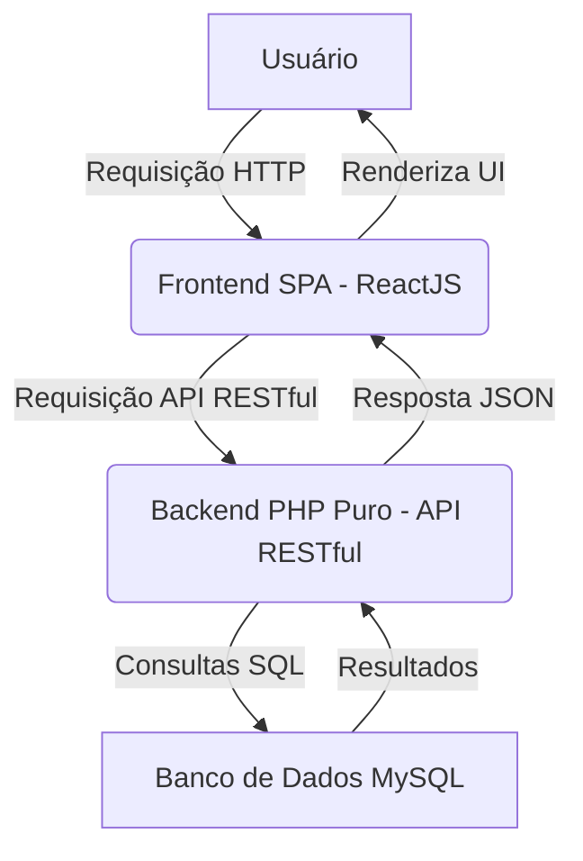

> [!WARNING]
> **DEPRECATED / HISTORICAL CONTEXT**
> This directory contains documentation relating to an earlier proposed architecture (React + PHP).
> The actual system was built using **Tauri + SvelteKit + SQLite**.
>
> Please refer to [../../docs/README.md](../../docs/README.md) for the actual system documentation.

# Documentação Técnica Base do Projeto de Refatoração

Este documento descreve a estratégia de refatoração do sistema Delphi para uma arquitetura web moderna, utilizando ReactJS no frontend e PHP puro como API RESTful no backend, com MySQL como banco de dados.

## 1. Estrutura Geral do Sistema e Objetivos da Refatoração

O projeto visa converter uma aplicação legada desenvolvida em Delphi para um stack tecnológico moderno, focado em web.

**Objetivos Principais:**
*   **Modernização Tecnológica:** Atualizar a base tecnológica para padrões web atuais, garantindo maior compatibilidade e longevidade.
*   **Melhoria da Experiência do Usuário:** Desenvolver uma interface mais intuitiva, responsiva e acessível.
*   **Escalabilidade:** Projetar uma arquitetura que permita o crescimento e a expansão futura do sistema.
*   **Manutenibilidade:** Facilitar a manutenção, o desenvolvimento de novas funcionalidades e a correção de bugs.
*   **Segurança:** Implementar boas práticas de segurança em todas as camadas da aplicação.

A arquitetura proposta é uma **Single Page Application (SPA)** no frontend, desenvolvida com **ReactJS**, e um **Backend API RESTful** em **PHP puro**, interagindo com um banco de dados **MySQL** com esquema normalizado.

## 2. Descrição das Pastas do Projeto

*   `dfm/`: Contém os arquivos de definição de formulários (`.dfm`) da aplicação Delphi original.
*   `pas/`: Contém as unidades Pascal (`.pas`) com a lógica de negócio e eventos da aplicação Delphi original.
*   `refactor/`: Diretório principal para o novo projeto web.
    *   `refactor/css/`: Contém os arquivos CSS para estilização do frontend ReactJS.
    *   `refactor/db/`: Contém os scripts SQL para a criação e gerenciamento do esquema de banco de dados MySQL normalizado.
    *   `refactor/docs/`: Contém a documentação técnica do projeto, incluindo este `README.md`.
    *   `refactor/js/`: Contém os arquivos JavaScript do frontend ReactJS (componentes, lógica de UI, etc.).
    *   `refactor/pages/`: Contém os componentes ReactJS que representam as "páginas" ou telas principais da aplicação.
    *   `refactor/php/`: Contém os arquivos PHP do backend, que implementam a API RESTful e a lógica de negócio.
*   `sql/`: Contém os scripts SQL originais do banco de dados Delphi (Firebird/Interbase).
*   `resto/`: Contém outros arquivos do projeto Delphi original, como arquivos de relatório (`.fr3`), arquivos de projeto (`.dpr`, `.dproj`), e arquivos de banco de dados legados (`.GDB`).
*   `__history/`: Diretório de histórico de arquivos do ambiente de desenvolvimento.
*   `__recovery/`: Diretório de arquivos de recuperação do ambiente de desenvolvimento.
*   `Win32/`: Diretório contendo arquivos de compilação e executáveis da aplicação Delphi para Windows 32-bit.

## 3. Metodologia de Conversão e Padronização Adotada

A conversão seguirá uma abordagem iterativa, focando na separação de preocupações e na adoção de padrões modernos de desenvolvimento web.

*   **Mapeamento de Componentes:**
    *   **Visuais:** Componentes visuais Delphi (`.dfm`) serão traduzidos para componentes ReactJS (HTML, CSS, JavaScript), recriando o layout e a interatividade.
    *   **Não Visuais:** A funcionalidade de componentes não visuais (e.g., acesso a dados) será abstraída para o backend PHP.
*   **Lógica de Negócio:**
    *   A lógica de negócio em Pascal será refatorada e distribuída:
        *   **PHP Puro (Backend):** Regras de negócio críticas, validações de dados sensíveis, cálculos complexos e operações transacionais.
        *   **ReactJS (Frontend):** Lógica de UI/UX, gerenciamento de estado do componente e validações de formulário para feedback imediato.
*   **Acesso a Dados:**
    *   A interação com o banco de dados MySQL (esquema normalizado) será gerenciada exclusivamente pelo backend PHP.
    *   Será implementada uma Camada de Acesso a Dados (DAL) em PHP puro, utilizando `mysqli` ou PDO com *prepared statements* para todas as operações SQL, garantindo segurança e eficiência.
*   **Arquitetura:**
    *   Adoção de uma arquitetura SPA com ReactJS no frontend e uma API RESTful em PHP puro no backend, promovendo a desacoplamento e a escalabilidade.

## 4. Convenções de Nomenclatura e Organização de Código

### Frontend (ReactJS)

*   **Componentes:** `PascalCase` (ex: `MeuComponente.jsx`).
*   **Funções/Variáveis:** `camelCase`.
*   **Estilos (CSS):** Preferencialmente utilizando metodologias como BEM (Block-Element-Modifier) ou CSS Modules para evitar conflitos e promover a modularidade.
*   **Estrutura de Pastas:** Organização por funcionalidade ou tipo de componente (ex: `components/`, `pages/`, `hooks/`, `utils/`).

### Backend (PHP Puro)

*   **Arquivos:** `snake_case` (ex: `clientes_api.php`, `database_connection.php`).
*   **Funções/Variáveis:** `camelCase`.
*   **Classes:** `PascalCase`.
*   **Métodos:** `camelCase`.
*   **Constantes:** `SCREAMING_SNAKE_CASE`.
*   **Estrutura de Pastas:** Organização por recurso da API (ex: `php/api/clientes/`, `php/core/`, `php/config/`).

### Banco de Dados (MySQL)

*   **Tabelas:** `snake_case`, no plural (ex: `clientes`, `pedidos`, `produto_grupos`).
*   **Colunas:** `snake_case`, no singular (ex: `nome`, `cpf_cnpj`, `cliente_id`).
*   **Chaves Primárias:** `id` (auto-incremento).
*   **Chaves Estrangeiras:** `nome_da_tabela_referenciada_id` (ex: `cliente_id` em `pedidos`).

---